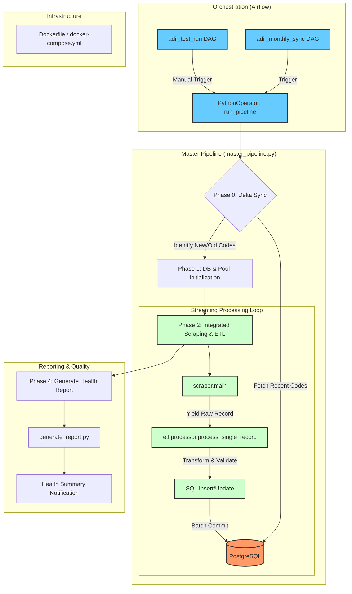

# End-to-End Pipeline Architecture

## Expert High-Fidelity Rendering: Streaming Lifecycle

This diagram illustrates the automated scraping and ETL pipeline for the ADIL HS Code project.

## Technical Scenario & Architecture Narrative

For a senior reviewer, this section outlines the system's operational logic, design patterns, and robustness features.

### 1. Orchestration & Triggering
The system is orchestrated using **Apache Airflow** running in a **Docker** environment. 
- **Automated Sync**: A monthly DAG (`adil_monthly_sync`) handles periodic updates.
- **Manual/Test Runs**: Specifically defined DAGs allow for targeted runs or full system testing.

### 2. Intelligent Delta Sync (Phase 0)
To optimize resources and avoid WAF (Web Application Firewall) triggers on the ADIL website, the **Master Pipeline** implements a delta sync logic:
- Before starting, the pipeline queries **PostgreSQL** to identify HS codes processed within the last 25 days.
- These codes are cached and skipped during the scraping phase, ensuring we only fetch new or stale data.

### 3. Integrated Streaming ETL (Phase 1-3)
The core logic resides in an **Integrated Streaming Layer**. Instead of a traditional "Scrape-then-Process" approach, the system uses Python generators:
- **Streaming Scraper**: Hits the ADIL targets and `yields` raw records as they are retrieved.
- **Transformation (ETL)**: Each raw record is immediately passed to the `etl.processor`.
- **Validation**: Data is validated against strict relational schemas (handling nested tables like taxes, documents, and agreements).
- **Atomic Persistence**: Records are committed to PostgreSQL in **batches of 50**. This balances I/O performance with data safety—if a batch fails, only that batch is rolled back, not the entire run.

### 4. Infrastructure & Persistence
- **Runtime**: Containerized via **Docker Compose**, ensuring environment parity across development and production.
- **Storage**: **PostgreSQL 15** manages the relational data, with complex constraints ensuring referential integrity for HS code hierarchies.

### 5. Monitoring & Quality Assurance
- **Health Reporting**: A post-run task executes `generate_report.py` to analyze sync success rates and data coverage.
- **Logging**: Centralized logging via a custom `ScraperConfig` provides granular visibility into the multi-threaded scraping process.

## Formal Architectural Strategy: Native Streaming ETL

To communicate the work to a Senior Architect, the "Actual Approach" implemented in this repository is a **Native Streaming Architecture**, specifically designed to avoid the pitfalls of traditional Batch processing.

### 1. The Core Distinction: Streaming vs. Batch
| Feature | Traditional Batch Approach | **Our Streaming Approach** |
| :--- | :--- | :--- |
| **Logic** | Scrape All -> ETL All -> Write All | **Scrape(1) -> ETL(1) -> Write(1)** (Repeated) |
| **Memory** | Grows linearly with data size (Risky) | **Constant/Flat memory overhead** (Safe) |
| **Persistence** | One giant transaction at the end | **Incremental Micro-batches (N=50)** |
| **Recovery** | Lose all work if crash at code 12,999 | **Lose max 50 records** if system fails |

### 2. High-Level Mechanism: The "Data Pipeline"
The pipeline functions as a single, continuous flow:

1.  **Concurrent Ingestion (Source)**: `ADILScraper` uses a pool of threads to fetch data. It uses **Python Generators (`yield`)** to push data out the moment it's ready.
2.  **On-the-Fly Transformation (ETL)**: The `master_pipeline.py` consumes the stream from the source. It doesn't store the records in a list; it immediately passes them to the ETL processor for cleaning and validation.
3.  **Real-Time Database Staging (Load)**: Every record is immediately staged in a PostgreSQL transaction.
4.  **Atomic Micro-batching (Commit)**: We finalize the save every 50 records. This is the **Checkpoint System** that makes the pipeline professional and resilient.

### 3. Expert Design Summary
> "By choosing a **Streaming ETL** over a **Batch ETL**, we have built a system that is theoretically capable of processing millions of HS codes on a lightweight machine with zero risk of memory overflow and a built-in resilience against mid-run failures."

---
